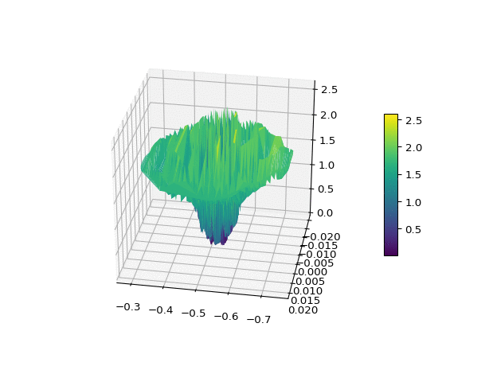
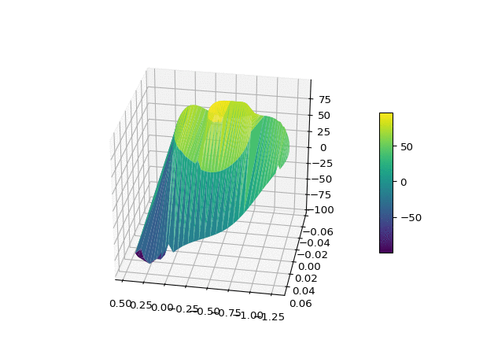
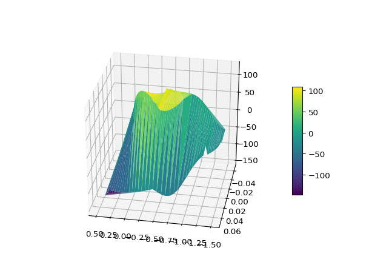

# MountainCar-SARSA
Python Implementation of discrete and Radial basis function SARSA on mountaincar environment
1) Discretization: 65 discrete static states.
2) Radial basis approx: 64 basis given by linear combination of 64 guassians.

## Results
### Discretized SARSA
*Plot of rewards vs number of episodes*

                
*Plot of Cost-to-go function vs Postion, Velocity*

<figure>
   
  <figcaption align="center"> Fig 1: Episode 0 </figcaption>
  
  <figcaption> Fig 2: Episode 12 </figcaption> 
  
  <figcaption> Fig 3: Episode 100 </figcaption>
  
  <figcaption> Fig 4: Episode 1000 </figcaption>
<figure>

### Radial Basis function SARSA
*Plot of rewards vs number of episodes*

             

*Plot of Cost-to-go function vs Postion, Velocity*

<figure>
   
  <figcaption> Fig 1: Episode 0 </figcaption>
  
  <figcaption> Fig 2: Episode 250 </figcaption> 
  
  <figcaption> Fig 3: Episode 1000 </figcaption>
  
  <figcaption> Fig 4: Episode 2000 </figcaption>
<figure>
  
Sources:
1) Sutton, R.S., 1996. Generalization in reinforcement learning: Successful examples using sparse coarse coding. In Advances in neural information processing systems (pp. 1038-1044).
2) Sutton, R.S. and Barto, A.G., 1998. Introduction to reinforcement learning (Vol. 135). Cambridge: MIT press.
