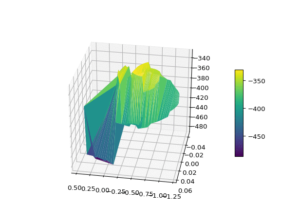

# MountainCar-SARSA
Python Implementation of discrete and Radial basis function SARSA on mountaincar environment

## Results

<figure>
  <figcaption> Episode 0 </figcaption>
   
  
  <figcaption> Episode 12 </figcaption>
<figure>
  
  
  
  
<figure>
  <figcaption> Episode 100 </figcaption>  
  
  
  <figcaption> Episode 1000 </figcaption>
<figure>

