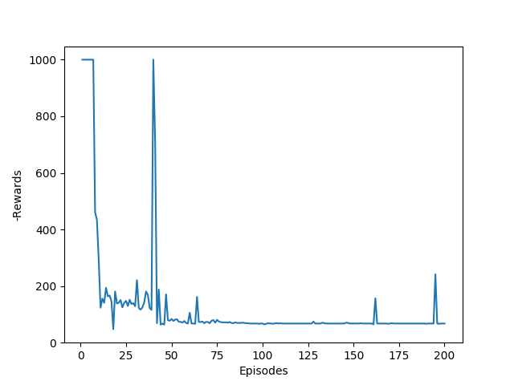

# MountainCar-SARSA
Python Implementation of discrete and Radial basis function SARSA on mountaincar environment

## Results
### Discretized SARSA
*Plot of rewards vs number of episodes*

<figure>
                      
  <figcaption> plot </figcaption>
<figure>
*Plot of Cost-to-go function vs Postion, Velocity*

<figure>
   
  <figcaption> Episode 0 </figcaption>
  
  <figcaption> Episode 12 </figcaption> 
  
  <figcaption> Episode 100 </figcaption>
  
  <figcaption> Episode 1000 </figcaption>
<figure>

### Radial Basis function SARSA
*Plot of rewards vs number of episodes*

                 

*Plot of Cost-to-go function vs Postion, Velocity*
